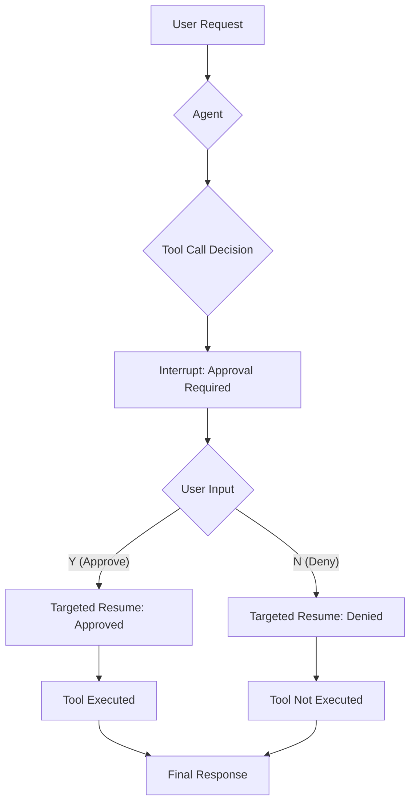

# Human-in-the-Loop: Approval Pattern

This example demonstrates a fundamental "human-in-the-loop" pattern: **Approval**.

It showcases how to build an agent that attempts to perform a sensitive action, pauses to request explicit user confirmation, and only proceeds after receiving approval.

## How It Works

1.  **Approvable Tool**: The agent is given a special tool (`BookTicket`) that is wrapped in an `InvokableApprovableTool`. This wrapper ensures that before the tool's function is executed, the agent must first get permission.

2.  **Agent Interrupt**: When the agent decides to use the `BookTicket` tool, the framework doesn't execute it. Instead, it triggers an **interrupt**. The agent's execution is paused, and an `InterruptInfo` object is sent back to the main application loop. This object contains details about the action that requires approval, such as the tool name and the parameters the agent intends to use.

3.  **User Confirmation**: The `main.go` logic catches this interrupt and prints the details of the pending action to the console. It then prompts the user to input "Y" (Yes) or "N" (No).

4.  **Targeted Resume**:
    *   If the user approves, the application calls `runner.TargetedResume`, sending back the approval. The framework then unpauses the agent, which proceeds to execute the `BookTicket` tool.
    *   If the user denies, the agent is also resumed, but it is informed of the denial, and it will not execute the tool.

## How to Run

Ensure you have your environment variables set (e.g., for the LLM API key). Then, run the following command from the root of the `eino-examples` repository:

```sh
go run ./adk/human-in-the-loop/approval
```

You will see the agent's reasoning, followed by a prompt asking for your approval to book the ticket. Enter `Y` to see the agent complete the action.

## Workflow Diagram

