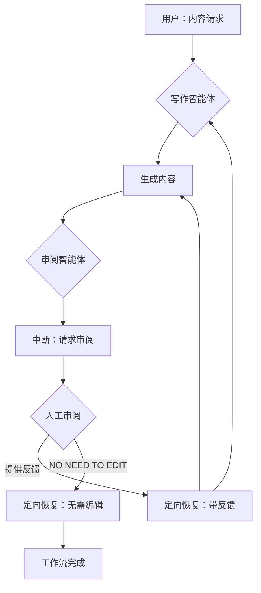

# 人机协同：审阅与编辑模式

本示例演示了一个复杂的"人机协同"模式：**审阅与编辑**。它展示了一个多智能体工作流，其中一个智能体生成内容，另一个智能体请求人工审阅，系统支持基于人工反馈的迭代优化。

## 工作原理

此实现使用**多智能体架构**，两个专业智能体协同工作：

1. **写作智能体**：一个专门生成创意内容（本示例中为诗歌）的智能体。它生成初稿，并能根据反馈创建修订版本。

2. **审阅智能体**：作为写作智能体与人工审阅者之间的桥梁。它：
   - 捕获写作智能体生成的内容
   - 触发中断以请求人工审阅
   - 处理带有人工反馈的恢复过程
   - 将反馈传递给写作智能体，或在无需编辑时退出循环

### 工作流序列

1. **初始请求**：用户请求内容创建（例如，"写一首关于土豆的短诗"）
2. **内容生成**：写作智能体生成初始内容
3. **审阅中断**：审阅智能体捕获内容并触发中断，将其呈现给人工审阅
4. **人工审阅**：人工可以：
   - 提供具体的改进反馈
   - 如果内容令人满意，指示"NO NEED TO EDIT"
5. **恢复与迭代**：系统根据人工反馈恢复：
   - 如果提供了反馈，写作智能体生成修订版本
   - 如果选择了"NO NEED TO EDIT"，工作流完成
6. **循环继续**：该过程可以重复进行多次审阅和优化迭代

## 展示的关键特性

- **多智能体协作**：展示不同智能体如何在协调的工作流中协同工作
- **有状态中断**：审阅智能体维护关于被审阅内容的状态
- **迭代优化**：支持多轮人工反馈和内容改进
- **灵活退出条件**：允许人工指示内容何时令人满意

## 如何运行

确保您已设置好环境变量（例如，LLM API 密钥）。然后，在 `eino-examples` 仓库的根目录下运行以下命令：

```sh
go run ./adk/human-in-the-loop/review-and-edit
```

您将看到：
1. 写作智能体生成关于土豆的诗歌
2. 提示询问您的审阅反馈
3. 选择提供具体反馈或输入"NO NEED TO EDIT"
4. 系统整合您的反馈并生成修订内容

## 工作流程图



## 实际示例

以下是运行示例的实际跟踪记录，展示了迭代审阅过程的工作原理：

```
name: WriterAgent
path: [{Writer MultiAgent} {WriterAgent}]
answer: Hidden beneath earth's gentle fold,
A humble potato, golden and bold.

name: ReviewerAgent
path: [{Writer MultiAgent} {WriterAgent} {ReviewerAgent}]
Original content to review:
`
Hidden beneath earth's gentle fold,
A humble potato, golden and bold.
`.
If you think the content is good as it is, please reply with "No need to edit".
Otherwise, please provide a review comment.

your input here: Make it more funny.

name: ReviewerAgent
path: [{Writer MultiAgent} {WriterAgent} {ReviewerAgent}]
answer: Make it more funny.

name: WriterAgent
path: [{Writer MultiAgent} {WriterAgent} {ReviewerAgent} {WriterAgent}]
answer: I'm just a spud, not a fancy tomato,
But mash me up, I'm a party potato!

name: ReviewerAgent
path: [{Writer MultiAgent} {WriterAgent} {ReviewerAgent} {WriterAgent} {ReviewerAgent}]
Original content to review:
`
I'm just a spud, not a fancy tomato,
But mash me up, I'm a party potato!
`.
If you think the content is good as it is, please reply with "No need to edit".
Otherwise, please provide a review comment.

your input here: No need to edit

name: ReviewerAgent
path: [{Writer MultiAgent} {WriterAgent} {ReviewerAgent} {WriterAgent} {ReviewerAgent}]
action: exit
```

此跟踪记录展示了：
- **初始生成**：写作智能体创建关于土豆的严肃诗歌
- **人工反馈**：用户请求更幽默的语气
- **迭代改进**：写作智能体整合反馈并创建更有趣的版本
- **工作流完成**：用户批准修订版本，结束流程

路径表示法显示了分层智能体结构以及工作流如何通过多次迭代进展。

## 实现细节

### 智能体架构
- **WriterAgent**：使用 `adk.NewChatModelAgent` 和特定的诗歌写作指令
- **ReviewAgent**：实现 `adk.Agent` 接口的自定义智能体，包含中断/恢复逻辑
- **LoopAgent**：使用 `adk.NewLoopAgent` 包装两个智能体以创建多智能体工作流

### 状态管理
- `ReviewEditInfo` 结构维护：
  - `OriginalContent`：被审阅的内容
  - `ReviewComment`：人工改进反馈
  - `NoNeedToEdit`：指示内容令人满意的标志

### 中断/恢复逻辑
- 使用 `adk.StatefulInterrupt()` 暂停执行并请求人工输入，同时保持状态
- 实现 `Resume()` 方法来处理不同的恢复场景
- 支持基于反馈的迭代和工作流完成

## 使用场景

此模式适用于：
- 内容创建和优化（写作、设计、代码生成）
- 质量保证工作流
- 协作编辑过程
- 任何需要人工判断和迭代改进的场景

该实现展示了如何使用 Eino 框架的中断和恢复功能构建复杂的人机协同工作流。